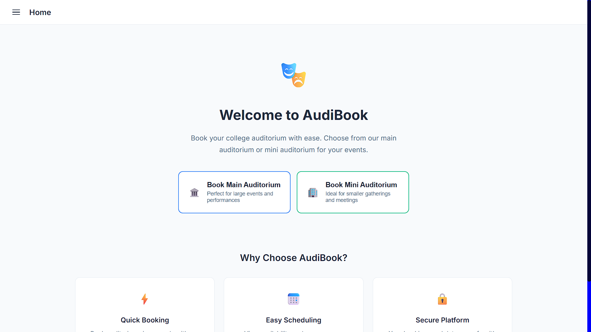
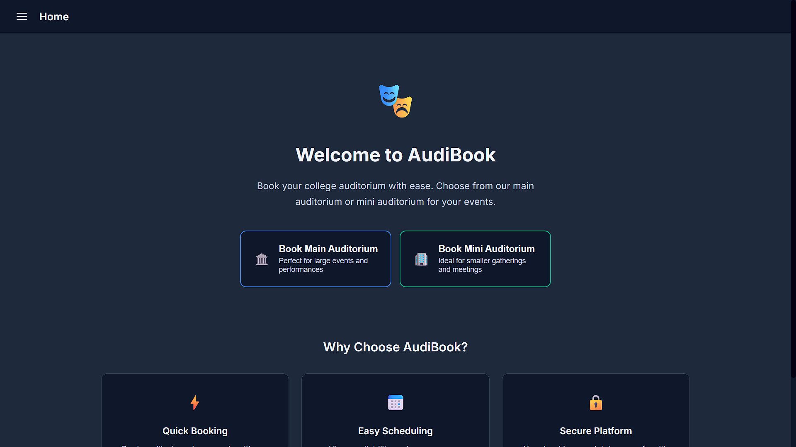
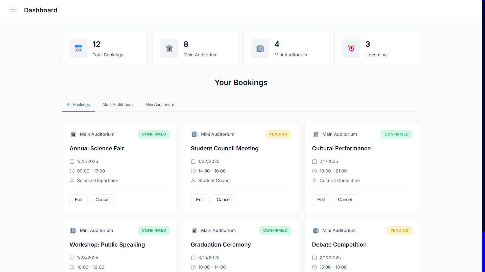
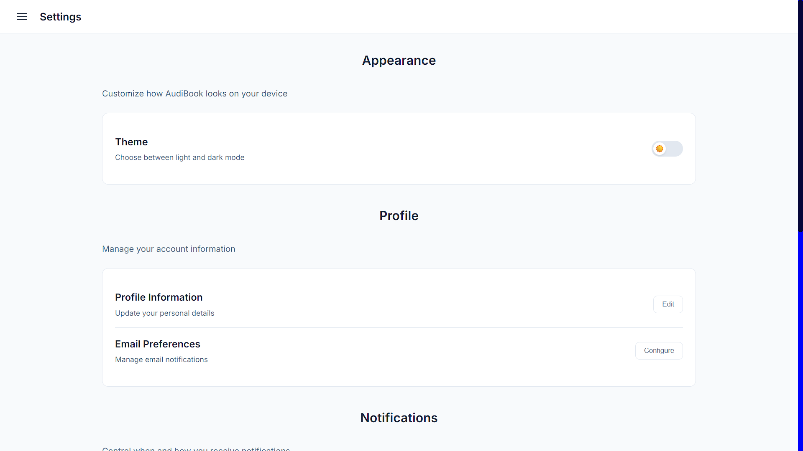
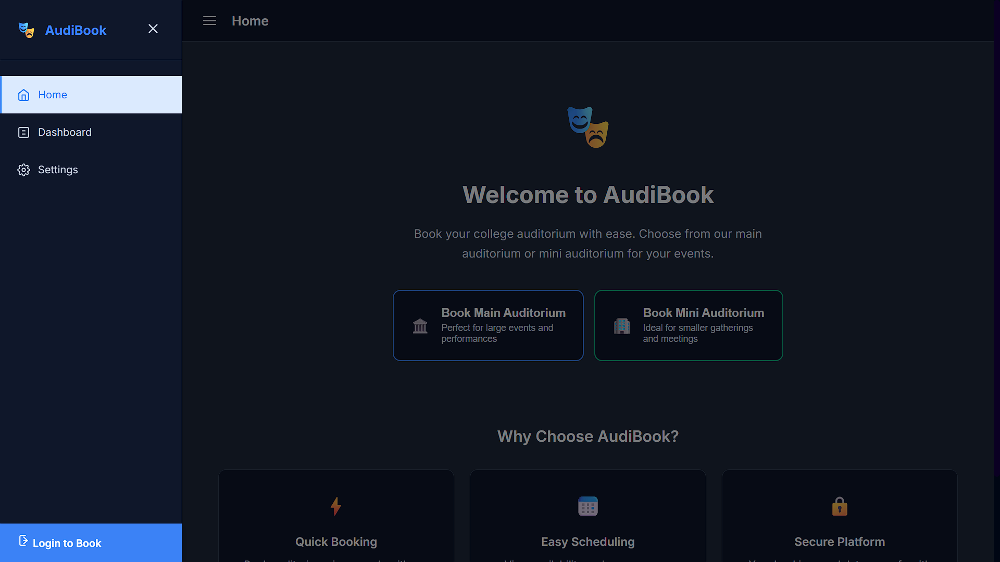
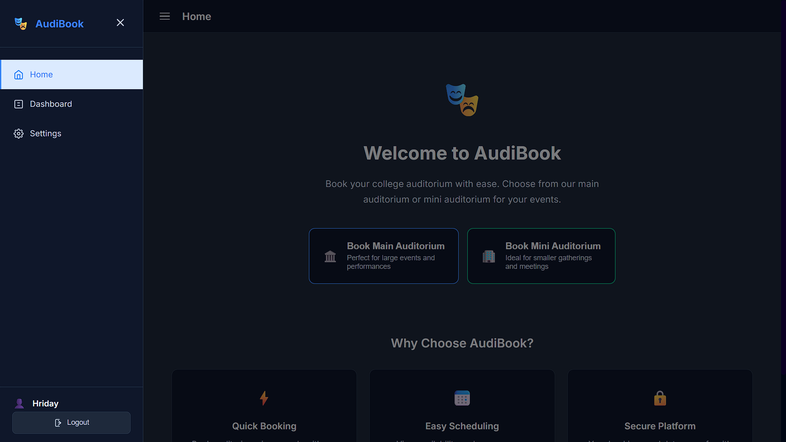

# 🎭 AudiBook

AudiBook (temporary name) provides a clean, responsive, and theme-friendly interface for managing auditorium bookings.  
It is built with **HTML, CSS, and JavaScript (just frontend)**.

---

## 🚀 Features (Work in Progress)

### frontend
- 📅 **Dashboard** with booking statistics and upcoming events
- 🌗 **Light/Dark Theme Toggle** (saves user preference)
- 🖥️ **Responsive Sidebar Navigation**
- 🏛️ **Main & Mini Auditorium Booking Filters**
- ⚙️ **Settings Page** for personalization
- ✨ Smooth **animations & transitions**

### backend

 - 🔑 **Authentication & Authorization** (signup, login, logout, role-based access)
 - 📝 **Dynamic Forms Handling** (booking forms, event registration, validation)
 - 📬 **Feedback & Contact Management** (submit, store, and view user feedback)
 - 💾 **Database Integration** (MySQL/PostgreSQL for users, bookings, and events)
 - 🔄 **API Endpoints** for data fetching & updates
 - ⚠️ **Input Validation & Security** (prevent invalid data and unauthorized access (not confirmed feature))
---

## 🖼️ Screenshots / Demo

- **Home Page (light)**
  

- **Home Page (dark)**
  

- **Dashboard**
  

- **Settings**
  

- **sidebar (before auth)**
  

- **sidebar (After auth)**
   

---
# Last Commit

---

## 🛠️ Tech Stack
- **Frontend:** HTML5, CSS3, JavaScript
- **Styling:** Custom CSS with CSS Variables

---

## 📌 Roadmap
- [ ] Backend integration (database + authentication)
- [ ] Booking management (create/update/delete)
- [ ] User profiles (restricted)
- [ ] Export reports / booking history
- [ ] Improved UI animations

---

## 📄 License
soon under MIT
